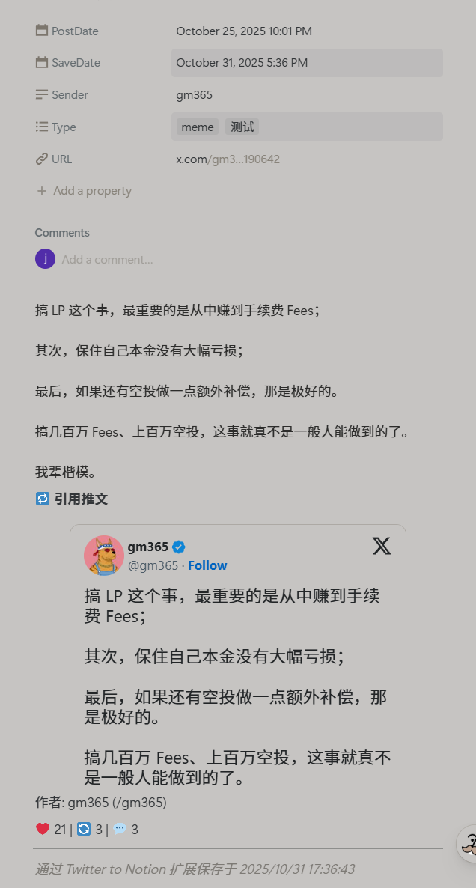

<!--
 * @Author: stark sicauva3@gmail.com
 * @Date: 2025-11-01 21:40:00
 * @LastEditors: stark sicauva3@gmail.com
 * @LastEditTime: 2025-11-02 22:11:15
 * @FilePath: \X2Notion\README.md
 * @Description: 这是默认设置,请设置`customMade`, 打开koroFileHeader查看配置 进行设置: https://github.com/OBKoro1/koro1FileHeader/wiki/%E9%85%8D%E7%BD%AE
-->
# 🐦 Twitter to Notion

[中文](README_CN.md) | **English**

A Chrome extension to save Twitter tweets, images, and quoted content directly to Notion with one click.

---

## ✨ Key Features

- 📥 **One-Click Save** - Quickly save tweets to Notion database
- 🖼️ **Media Support** - Fully save images, videos, and quoted tweets
- 🏷️ **Smart Categorization** - Support multiple custom tags
- 📊 **Data Analytics** - Automatically record likes, retweets, and comment counts
- 🕒 **Time Tracking** - Record both tweet publication and save timestamps
- 📝 **Content Integrity** - Long texts automatically chunked to ensure no content loss
- ✅ **Configuration Status** - Real-time configuration validation with click-to-verify

---

## 🚀 Quick Start

### ① Install Extension

1. Download the latest [`twitter-to-notion.zip`](https://github.com/SicauxiaoqiangNo1/twitter-to-notion-extension/releases)
2. Open Chrome → Extensions → Enable "Developer mode"
3. Click "Load unpacked" and select the extension folder

### ② Setup Notion Database

👉 [Duplicate Notion Template Database](https://bytebit.notion.site/Template-Twitter-to-Notion-database-29e5b64bde9a805bb305ea6a1b471193)
(Open the link and click **Duplicate** in the top right to copy to your workspace)

### ③ Configure Credentials

1. Click the extension icon and enter your **Database ID** and **API Key**
2. Open any tweet page and click the "💾 Save to Notion" button
3. Select categories and complete the save!

### 🔍 How to Get Configuration?

**Database ID**
- How to get: Extract the 32-character string from your Notion database page URL
- Visual guide: [Official Documentation](https://developers.notion.com/docs/getting-started#step-3-save-the-database-id)

**API Key**
- How to get: Create a new integration at [Notion Integrations](https://www.notion.so/my-integrations)
- Format: `secret_xxxxxxxxxxxxxxxxxxxxxxxx`

📚 Complete setup guide: [Notion API Getting Started](https://developers.notion.com/docs/getting-started)

### 🔧 Configuration Status Bar

The extension now provides intelligent configuration status display:

- **✅ Green Status**: Configuration is correct and valid
- **❌ Red Status**: Configuration is incorrect or invalid
- **Click to Verify**: Click the status bar to re-validate configuration

**Status Explanation**:
- Green✅: API Key and Database ID are correct, tweets can be saved normally
- Red❌: Configuration has issues, check API Key permissions or Database ID

This feature helps you quickly confirm if your configuration is working properly and avoid save failures.

---

## 📸 Preview

| Configuration | Save Button | Notion Result |
|---------------|-------------|---------------|
|  |  |  |
---

## 📁 Project Structure
```
twitter-to-notion-extension/
├── manifest.json # Extension configuration
├── background.js # Background script
├── content.js # Content script
├── popup.html # Popup interface
├── popup.js # Popup logic
├── icons/ # Extension icons
├── README.md # Documentation
└── .gitignore # Git ignore file
```

---

## 📄 License

MIT License - Free to use, modify, and distribute

---

## 👨‍💻 Author

- GitHub: [@SicauxiaoqiangNo1](https://github.com/SicauxiaoqiangNo1)
- Twitter: [@sicauman](https://x.com/sicauman)

---

## 🤝 Contributing

Issues and Pull Requests are welcome!
